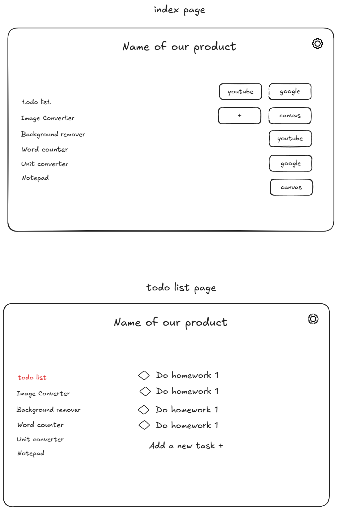

# plan
the plan for the school app

Ideal Technologies:
- SQLite
- Python
- Uv 
- Flask

Alternete Technologies 1:
- Django 
- Python
- SQ Lite
- UV

Alternete Technologies 2:
- HTML
- CSS
- JavaScript
- LocalStorage API
- GitHub 
 

---

To-do list (core)

Image converter

Background remover 

Word counter

Unit converter (length, weight, temp, currency)

Flashcard/quiz generator (maybe if we still have time)

---

